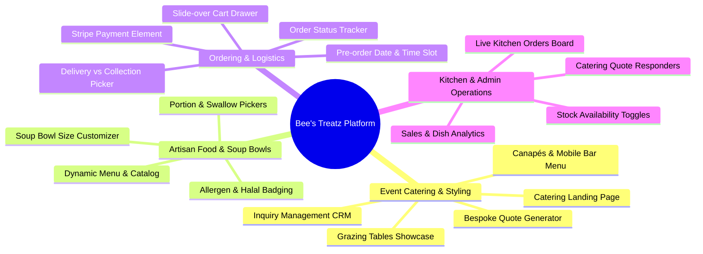
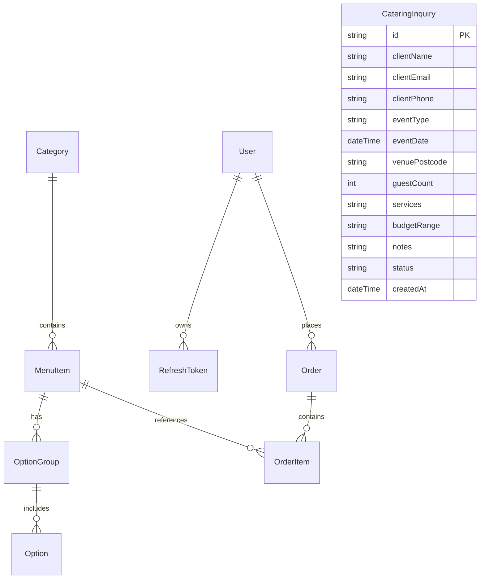
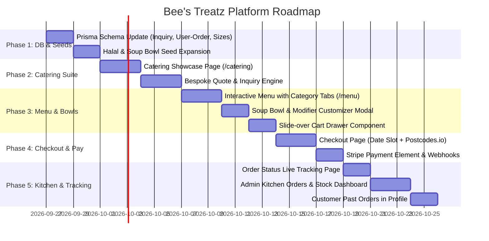

# 🍯 Product Requirements Document (PRD): Bee's Treatz Platform

**Document Version:** 2.0  
**Status:** In Progress / Feature Development  
**Target Market:** United Kingdom (London & Nationwide for Events)  
**Brand Identity:** Luxury Halal Afro-Fusion Catering, Food Styling & Artisan Bowl Kitchen  

---

## 1. Executive Summary & Brand Profile

### 1.1 About Bee's Treatz
**Bee's Treatz** is a premier UK-based culinary and event catering brand founded by Chef Bee. The brand bridges authentic West African flavours with luxury, modern food styling. 

From her signature Instagram portfolio:
> **Caterer**  
> **Food Styling | Canapés | Grazing Tables**  
> **Mobile Bar | Food and Soup Bowls**  
> **Weddings | Corporate | Intimate Gatherings**  
> **100% Halal**

Bee's Treatz operates two synergistic business verticals:
1. **Bespoke Event Catering & Experiences**: High-end food styling, lavish Halal grazing tables, cocktail canapés, mobile bar setups, and full-service banquet catering for weddings, corporate galas, and intimate celebrations.
2. **Artisan Food & Soup Bowls (Direct-to-Consumer / Pre-Order Kitchen)**: Fresh, large-format family and party tubs (1L, 2L, 4L) of slow-cooked Nigerian soups (Egusi, Seafood Okro, Ogbono, Efo Riro), iconic party rice dishes (Smoky Jollof, Native Fried Rice), and small chop platters delivered to doorsteps across London.

### 1.2 Mission & Value Proposition
- **100% Certified Halal**: Complete peace of mind for Muslim clients and diverse event guestlists without compromising on authentic heritage recipes.
- **Visual Food Artistry & Styling**: Food that looks like an editorial spread — custom florals, tiered acrylic grazing displays, bespoke drink garnishes.
- **Warm UK-Naija Hospitality**: Authentic firewood-style smokiness, premium cuts of meat, and high-standard British food safety compliance (Natasha's Law allergen labeling, hygiene standards).

---

## 2. Target Audience & User Personas

| Persona | Needs & Goals | Core Platform Touchpoint |
|---|---|---|
| **The Wedding Couple (Amina & Tunde)** | Planning a 150-guest traditional/white wedding. Needs Halal-friendly luxury Nigerian catering, a show-stopping grazing table for drinks reception, and a mobile bar with custom mocktails. | `/catering` showcase, Bespoke Event Quote Builder, Tasting Consultation booking. |
| **The Corporate Event Manager (Sarah, Tech Firm)** | Organising diversity celebrations, product launches, or office Christmas parties in Central London. Needs finger food canapés, professional styling, and prompt invoicing. | Corporate Canapé & Grazing Packages, Quick Quote Request, Invoice generation. |
| **The Intimate Host (Kemi)** | Hosting a birthday dinner or bridal shower for 20 friends at home. Wants a 1.5-meter grazing table, cocktail canapés, and bespoke bar service without stress. | Intimate Gathering packages, date availability checker. |
| **The Busy Foodie / Family (David)** | Craving home-cooked Nigerian dishes in London. Wants 2L or 4L tubs of Egusi, Efo Riro, and Smoky Jollof delivered for weekly meal prep or Sunday dinners. | Direct-to-Consumer `/menu`, Soup Bowl Customizer (Swallow & Protein selection), Scheduled Delivery checkout. |

---

## 3. Platform Architecture & Status Audit

```
┌─────────────────────────────────────────────────────────────────────────────┐
│                             BEE'S TREATZ PLATFORM                           │
├──────────────────────────────────────┬──────────────────────────────────────┤
│               FRONTEND               │               BACKEND                │
│       Next.js 16 (Turbopack)         │     Node.js + Express + TypeScript   │
│   Tailwind CSS v4 + Base-UI/Radix    │         Prisma ORM + PostgreSQL      │
│      Zustand Global State Stores     │       Stripe + Resend + Postcodes.io │
└──────────────────────────────────────┴──────────────────────────────────────┘
```

### 3.1 What Has Been Completed ✅
1. **Customer Authentication & Security**:
   - Full JWT session management (Access tokens in cookies/localStorage + HttpOnly refresh token rotation).
   - Customer Register, Login with lockout protection (5 failed attempts).
   - Email Verification system with Resend API + 24h expiration tokens.
   - Password Reset & Forgot Password flows with secure single-use SHA-256 tokens.
   - In-app 2FA Email OTP Verification for profile password changes.
2. **Customer Account Hub (`/profile`)**:
   - Profile summary card with Nigerian foodie avatars + custom canvas-compressed photo uploads.
   - Account settings (Full name, phone, UK location).
   - Saved address manager integrated with UK regions & Postcodes.io format.
   - State management fully transitioned to dedicated Zustand store (`useProfileStore`).
3. **Core Store Infrastructure**:
   - `useAuthStore` (Auth state, token, user profile).
   - `useProfileStore` (Profile UI, tabs, avatar modal, verification actions).
   - `useCartStore` (Persistent cart, item modifiers, subtotal computation).
   - `useCheckoutStore` (Delivery info, postcode verification).
4. **Initial Backend Foundations**:
   - Express API structure, rate limiters, auth middlewares, security sanitization.
   - Basic Prisma models (`User`, `AdminUser`, `Category`, `MenuItem`, `OptionGroup`, `Option`, `Order`, `OrderItem`).
   - UK Postcode distance & delivery fee engine (`postcodes.io`).
   - Stripe Checkout session creation logic with simulation mode.

---

## 4. Gap Analysis: What Is Left To Build 🚧

To truly reflect Chef Bee's business and enable both **Event Catering Inquiries** and **Food & Soup Bowls eCommerce**, the following modules are required:



---

## 5. Detailed Functional Specifications

### Module A: Bespoke Catering & Event Booking Suite
*Catering is high-ticket revenue for weddings, corporate galas, and celebrations.*

1. **Catering Experience Page (`/catering`)**:
   - **Hero & Philosophy**: Showcase Halal luxury Afro-fusion food styling.
   - **Service Showcases**:
     - **Grazing Tables**: Visual gallery of lush flat-lay & multi-level tables (cheeses, suya bites, fruits, pastries, artisanal dips).
     - **Canapés & Small Chops**: Cocktail finger foods (Plantain cups, puff-puff skewers, mini beef/chicken pies, akara bites).
     - **Mobile Bar**: Signature mocktails (Zobo spritz, Chapman), cocktail packages, mixologists, champagne towers.
     - **Food Styling**: Floral integration, luxury tableware, custom menu cards.
     - **Full Buffet / Plated Dining**: Traditional wedding banquets.
   - **Social Proof**: Instagram feed widget / curated client reviews from weddings & corporate clients.
2. **Interactive Catering Quote & Inquiry Engine (`/catering/inquire`)**:
   - Multi-step booking request form:
     - **Step 1: Event Essentials**: Event Type (Wedding, Corporate, Intimate Gathering, Birthday), Date, Time, Venue Name & Postcode, Guest Count.
     - **Step 2: Desired Services**: Checkboxes for Grazing Table, Canapés, Mobile Bar, Food Bowls / Buffet, Full Waitstaff.
     - **Step 3: Dietary & Styling Needs**: 100% Halal confirmation, Allergies, Color theme/styling notes.
     - **Step 4: Contact Details & Budget**: Name, Email, Phone, Estimated Budget Range (£500–£1,500, £1,500–£5,000, £5,000+).
   - **Backend Processing**:
     - Saves inquiry into `CateringInquiry` table.
     - Sends immediate branded auto-responder email to client via Resend.
     - Sends notification alert to Chef Bee (`admin@beestreatz.co.uk`) with all event parameters.

---

### Module B: Food & Soup Bowls Ordering Experience
*Empowering clients to buy weekly bowls and party trays online with custom options.*

1. **Menu & Catalog Page (`/menu`)**:
   - **Category Navigation Tabs**:
     - *Soup Bowls (1L, 2L, 4L Tubs)*
     - *Rice Dishes & Party Trays*
     - *Canapés & Small Chop Platters*
     - *Grills & Meat Bowls (Suya, Asun, Turkey)*
     - *Drinks & Mocktails (1L bottles of Zobo, Chapman)*
   - **Filter & Search Bar**: Search dishes, filter by dietary requirements (Gluten-Free, Spicy, Vegetarian, Nut-Free).
   - **Halal Assurance Banner**: Reassuring 100% Halal certification on every product card.
2. **Item Detail & Customization Modal**:
   - **Container / Size Selector**:
     - E.g. for Egusi Soup: *Standard Single Bowl (750ml)* vs *Family Tub (2 Litres)* vs *Party Feast Tub (4 Litres)*.
   - **Swallow Options** (Radio selection): Pounded Yam, Eba, Amala, Semo, or None (Soup Only).
   - **Protein Choices**: Assorted Meats (Shaki, Abodi, Beef), Goat Meat, Fresh Catfish, Fried Tilapia, Hard Chicken.
   - **Spice Level Selector**: Mild, Medium (Standard Naija), Fiery Hot.
   - **Special Instructions**: Allergy notes or preparation preferences.
   - **Add to Cart CTA**: Dynamic price update reflecting selected size and protein add-ons.

---

### Module C: Cart Drawer & Checkout Pipeline
1. **Interactive Cart Slide-over Drawer**:
   - Accessible from top navigation bar with live item count badge.
   - Line items display dish name, selected size, chosen swallow/proteins, and quantity controls (`+` / `-` / `delete`).
   - Order type toggle: **Delivery** vs **Collection**.
   - Subtotal, calculated delivery fee preview, and free delivery progress bar (e.g., "Add £12.50 more for FREE delivery!").
2. **Checkout Flow (`/checkout`)**:
   - **Step 1: Customer & Delivery Information**:
     - Auto-populated from logged-in user profile (`name`, `email`, `phone`, `address`, `postcode`).
     - Guest checkout support with optional "Save account" checkbox.
     - Live UK Postcode radius validation via Postcodes.io (validates within delivery zone, outputs delivery fee).
   - **Step 2: Delivery Date & Time Slot Picker**:
     - Since fresh soup tubs and catering bowls require kitchen prep, customers can select delivery dates (Next-day delivery or advance scheduled dates) and time slots (12pm–3pm, 4pm–7pm).
   - **Step 3: Secure Payment via Stripe**:
     - Stripe Payment Element supporting UK Debit/Credit cards, Apple Pay, and Google Pay.
     - Webhook listener `checkout.session.completed` marks order `PAID` and triggers confirmation emails.

---

### Module D: Order Tracking & Customer History
1. **Live Order Status Page (`/order-status/[orderId]`)**:
   - Visual progress stepper:
     1. `Order Placed` (Confirmed & Payment Verified)
     2. `Kitchen Preparing` (Chef Bee is cooking)
     3. `Ready for Dispatch / Collection`
     4. `Out for Delivery`
     5. `Delivered / Completed`
   - Real-time order summary, selected options breakdown, delivery address, and estimated delivery window.
2. **Customer Order History (`/profile?tab=orders`)**:
   - Replaces the current empty state placeholder with actual customer past orders.
   - View previous orders, invoice receipts, and one-click "Re-order" button.

---

### Module E: Kitchen Operations & Admin Suite (`/admin`)
1. **Kitchen Live Orders Kanban (`/admin`)**:
   - Columns: `New Orders`, `In The Kitchen (Cooking)`, `Ready / Dispatched`, `Completed`.
   - Real-time audio/visual alert for incoming orders.
   - Printable kitchen prep ticket formatted for chef order prep.
2. **Menu & Stock Management (`/admin/menu`)**:
   - Toggle availability for menu items and specific option groups (e.g. mark "Pounded Yam" or "Goat Meat" sold out when inventory runs low).
   - Adjust prices, edit descriptions, upload dish imagery.
3. **Catering Inquiries CRM (`/admin/inquiries`)**:
   - Table of incoming wedding, corporate, and private catering requests.
   - Status transitions: `NEW` ➔ `REVIEWED` ➔ `QUOTE_SENT` ➔ `CONFIRMED` ➔ `DECLINED`.
   - Notes section for guest tasting notes and bespoke menu agreements.

---

## 6. Database Schema Evolution

To support food & soup bowl sizes, catering inquiries, and user order histories, `backend/prisma/schema.prisma` will be updated:

### 6.1 Entity Relationship Diagram



### 6.2 Key Schema Additions
1. **Link `Order` to `User`**:
   ```prisma
   model Order {
     id                    String      @id @default(uuid())
     orderNumber           String      @unique
     userId                String?     // Optional for guest checkout
     user                  User?       @relation(fields: [userId], references: [id], onDelete: SetNull)
     customerName          String
     customerEmail         String
     customerPhone         String
     orderType             String      @default("DELIVERY")
     deliveryDate          DateTime?   // Scheduled prep/delivery date
     timeSlot              String?     // e.g. "14:00 - 17:00"
     ...
   }
   ```
2. **Catering Inquiry Table (`CateringInquiry`)**:
   ```prisma
   model CateringInquiry {
     id            String   @id @default(uuid())
     clientName    String
     clientEmail   String
     clientPhone   String
     eventType     String   // WEDDING | CORPORATE | INTIMATE | BIRTHDAY | OTHER
     eventDate     DateTime
     venueLocation String
     venuePostcode String?
     guestCount    Int
     services      String   // JSON string of selected services: ["GRAZING_TABLE", "CANAPES", "MOBILE_BAR"]
     budgetRange   String?  // e.g. "£1,500 - £3,000"
     dietaryNotes  String?
     stylingNotes  String?
     status        String   @default("NEW") // NEW | CONTACTED | QUOTED | CONFIRMED | DECLINED
     createdAt     DateTime @default(now())
     updatedAt     DateTime @updatedAt
   }
   ```
3. **Menu Item Enhancements**:
   - Add `categoryType`: `"DAILY_DISH" | "SOUP_BOWL" | "PARTY_TRAY" | "CANAPE_BOX" | "DRINK"`
   - Add `leadTimeHours`: Prep time needed (e.g. 24h for 4L soup bowls).
   - Add `isHalal`: Boolean (defaults to `true`).

---

## 7. Delivery & Localization Rules (United Kingdom)

1. **Currency**: Great Britain Pound (`£` / `GBP`) exclusively.
2. **Delivery Radius & Fees**:
   - Base Kitchen Postcode: `SE15 5BA` (Peckham, London).
   - Maximum radial distance for hot food/bowls: `6.0 miles`.
   - Tiered calculation:
     - 0 – 2 miles: `£3.50` base fee.
     - 2 – 6 miles: `£3.50 + £0.80/mile`.
     - Orders over `£50.00`: **Free Delivery**.
   - Beyond 6 miles: Direct collection available, or custom courier quote for large party trays & catering setups.
3. **Natasha's Law Compliance**:
   - Explicit declaration of the 14 major UK allergens (Peanuts, Tree Nuts, Crustaceans, Fish, Gluten, Eggs, Soybeans, Milk, Celery, Mustard, Sesame, Sulphites, Lupin, Molluscs).
   - Allergen filter on frontend menus.

---

## 8. Implementation Roadmap



---

## 9. Verification & Acceptance Criteria

1. **Brand Alignment**:
   - Every page highlights 100% Halal certification, authentic Nigerian flavours, and premium food styling.
   - Both individual food & soup bowl buyers and large wedding/corporate event organizers have dedicated, seamless entry points.
2. **Security & Performance**:
   - Zero client-side price tampering (cart totals recalculated on backend).
   - Fast Core Web Vitals (< 1.5s LCP) using Next.js Turbopack and optimized WebP images.
   - End-to-end data encryption and strict JWT / session security.
3. **Operational Clarity**:
   - Kitchen receives clear portion sizes, swallow choices, and spice levels.
   - Chef Bee receives structured catering leads with date, venue postcode, guest count, and service preferences ready for quoting.
